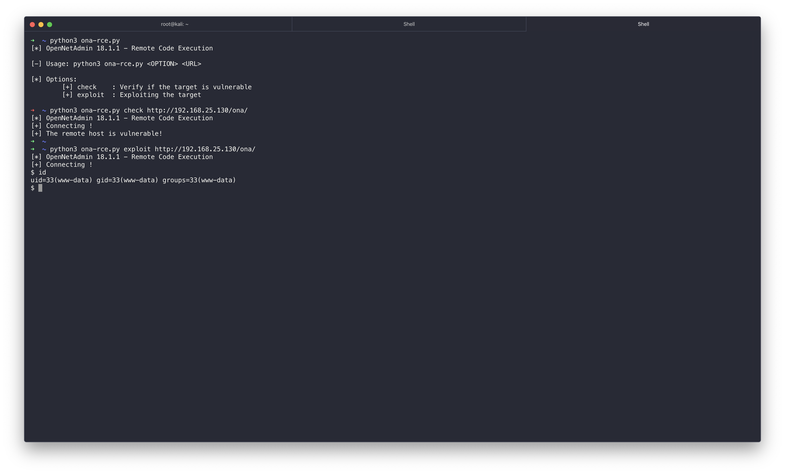

OpenNetAdmin 18.1.1 - Remote Code Execution
====

OpenNetAdmin 18.1.1 - Remote Code Execution
</br>
https://amriunix.com/

## Usage:
```shell
$ python3 ona-rce.py [check | exploit] <URL>
```
  * `check`     -- Verify if the target is vulnerable
  * `exploit`   -- Exploiting the target
  * `URL`       -- The remote target

## Installation

    pip3 install --user requests
    git clone https://github.com/amriunix/ona-rce.git

## PoC



### Disclaimer:

All the code provided on this repository is for educational/research purposes only. Any actions and/or activities related to the material contained within this repository is solely your responsibility. The misuse of the code in this repository can result in criminal charges brought against the persons in question. Author will not be held responsible in the event any criminal charges be brought against any individuals misusing the code in this repository to break the law.
